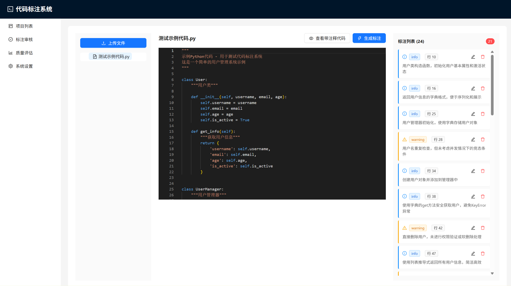

# CodeAnnotator

<div align="center">



**Intelligent Code Annotation System - Automatically add professional comments and annotations to code using AI**

[](https://opensource.org/licenses/MIT)
[](https://www.python.org/downloads/)
[](https://reactjs.org/)

[中文](README.md) | English

</div>

## Project Overview

CodeAnnotator is an AI-powered intelligent code annotation system that helps developers quickly add comments to code, identify potential issues, and provide optimization suggestions. The system supports multiple programming languages and integrates with various LLM providers including OpenAI, Claude, and Ollama.

## Key Features

- **AI-Powered Annotation**: Automatically generate code comments and annotations using large language models
- **Multi-LLM Support**: Supports three providers: OpenAI, Claude (Anthropic), and Ollama
- **Visual Annotation**: Monaco Editor provides VS Code-level code editing experience
- **Annotation Management**: Support for manual addition, editing, and review of annotations
- **Quality Assessment**: Automatically analyze code quality and generate quality reports
- **Multi-Language Support**: Supports Python, JavaScript, Java, C++, Go, and many other programming languages
- **Project Organization**: Support for multiple project management and file categorization

## Tech Stack

### Backend
- Python 3.10+
- FastAPI - Modern web framework
- SQLAlchemy - ORM database operations
- SQLite - Lightweight database
- OpenAI / Anthropic / Ollama - AI model integration

### Frontend
- React 18 - UI framework
- TypeScript - Type safety
- Ant Design - UI component library
- Monaco Editor - Code editor
- Vite - Build tool
- React Router - Route management

## Quick Start

### Prerequisites

- Python 3.10 or higher
- Node.js 16 or higher
- npm or yarn

### One-Click Installation (Windows)

```bash
# Run installation script
install.bat

# Start services
start-all.bat
```

### Manual Installation

#### 1. Clone Repository

```bash
git clone https://github.com/sir-lsr/CodeAnnotator.git
cd CodeAnnotator
```

#### 2. Install Backend Dependencies

```bash
cd backend
python -m venv venv

# Windows
venv\Scripts\activate

# Mac/Linux
source venv/bin/activate

pip install -r requirements.txt
```

#### 3. Configure Backend

Copy `backend/env.example` to `backend/.env` and configure API keys:

```env
OPENAI_API_KEY=your-openai-api-key-here
ANTHROPIC_API_KEY=your-anthropic-api-key-here
DEFAULT_LLM_PROVIDER=openai
DEFAULT_MODEL=gpt-3.5-turbo
```

#### 4. Install Frontend Dependencies

```bash
cd frontend
npm install
```

#### 5. Start Services

**Backend Service:**

```bash
cd backend
venv\Scripts\python.exe -m uvicorn app.main:app --reload --host 0.0.0.0 --port 8000
```

**Frontend Service:**

```bash
cd frontend
npm run dev
```

Visit http://localhost:5173 to use the system.

## Usage Guide

### 1. Create Project

Click "New Project" on the project list page and enter the project name and description.

### 2. Upload Code Files

After entering the project, click the "Upload File" button and select code files to upload. The system will automatically identify the programming language.

### 3. Generate AI Annotations

On the code annotation page, select a file and click the "Generate Annotations" button. The system will call the configured LLM to automatically generate code comments and annotations.

### 4. Add Manual Annotations

Click on a line number and fill in the annotation content and type (info/warning/suggestion/security) in the popup form.

### 5. Review Annotations

On the annotation review page, you can view all pending annotations and perform batch review operations.

### 6. View Quality Report

On the quality assessment page, you can view the overall quality score and detailed statistics of the project.

## Configuration

### LLM Configuration

The system supports three LLM providers:

1. **OpenAI**
   - Supports GPT-3.5, GPT-4, and other models
   - Supports custom API addresses (compatible with DeepSeek, etc.)

2. **Claude (Anthropic)**
   - Supports Claude 3 series models

3. **Ollama (Local)**
   - Supports locally deployed Ollama service
   - Default address: http://localhost:11434

You can configure LLM providers, API keys, and model selection on the system settings page.

### Annotation Types

The system supports four default annotation types:

- **info**: Function descriptions and code explanations
- **warning**: Potential issues or areas that need attention
- **suggestion**: Optimization suggestions
- **security**: Security-related tips

You can customize annotation types on the settings page.

## API Documentation

After starting the backend service, visit the following addresses to view API documentation:

- Swagger UI: http://localhost:8000/docs
- ReDoc: http://localhost:8000/redoc

## Project Structure

```
CodeAnnotator/
├── backend/                 # Backend service
│   ├── app/
│   │   ├── api/            # API routes
│   │   ├── models/         # Data models
│   │   ├── schemas/        # Data validation
│   │   ├── services/       # Business logic
│   │   ├── config.py       # Configuration management
│   │   ├── database.py     # Database connection
│   │   └── main.py         # Application entry
│   ├── uploads/            # Upload directory
│   ├── requirements.txt    # Python dependencies
│   └── README.md           # Backend documentation
├── frontend/               # Frontend application
│   ├── src/
│   │   ├── components/    # Reusable components
│   │   ├── pages/         # Page components
│   │   ├── services/      # API services
│   │   └── types/         # TypeScript types
│   ├── package.json       # Frontend dependencies
│   └── README.md          # Frontend documentation
├── docs/                   # Documentation and images
│   └── images/            # Project image resources
├── ARCHITECTURE.md         # Technical architecture documentation
├── .gitignore             # Git ignore file
├── README.md              # Main documentation (Chinese)
└── README_EN.md           # English documentation
```

## Development Guide

### Backend Development

```bash
cd backend
source venv/bin/activate  # or venv\Scripts\activate (Windows)
venv\Scripts\python.exe -m uvicorn app.main:app --reload
```

### Frontend Development

```bash
cd frontend
npm run dev
```

### Code Standards

- Backend: Follow PEP 8 Python code standards
- Frontend: Use ESLint and Prettier for code formatting

## Contributing

Contributions are welcome! Please check [CONTRIBUTING.md](CONTRIBUTING.md) for more details.

## License

This project is licensed under the MIT License. See the [LICENSE](LICENSE) file for details.

## FAQ

### Q: How to configure API keys?

A: Configure LLM API keys on the system settings page, or directly in the `backend/.env` file.

### Q: Which programming languages are supported?

A: Supports Python, JavaScript, TypeScript, Java, C++, Go, Rust, and many other mainstream programming languages.

### Q: Can I use a local LLM?

A: Yes, you can use Ollama to run LLM locally without API keys.

### Q: Where is the database file?

A: Uses SQLite database by default, located at `backend/database.db`. PostgreSQL is recommended for production environments.

### Q: How to backup data?

A: Just backup the `backend/database.db` file. Uploaded files are located in the `backend/uploads/` directory.

## Changelog

### v0.3.0
- Support for multiple LLM providers
- Optimized AI annotation generation quality
- Added quality assessment functionality
- Improved user interface

## Author

LSR-SIR

## Contact

If you have questions or suggestions, please submit an Issue or Pull Request.

## Acknowledgments

Thanks to all contributors and the open-source community for their support.

